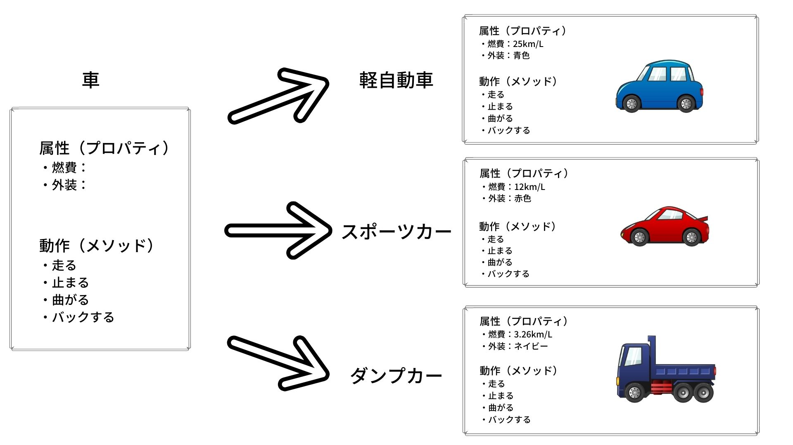
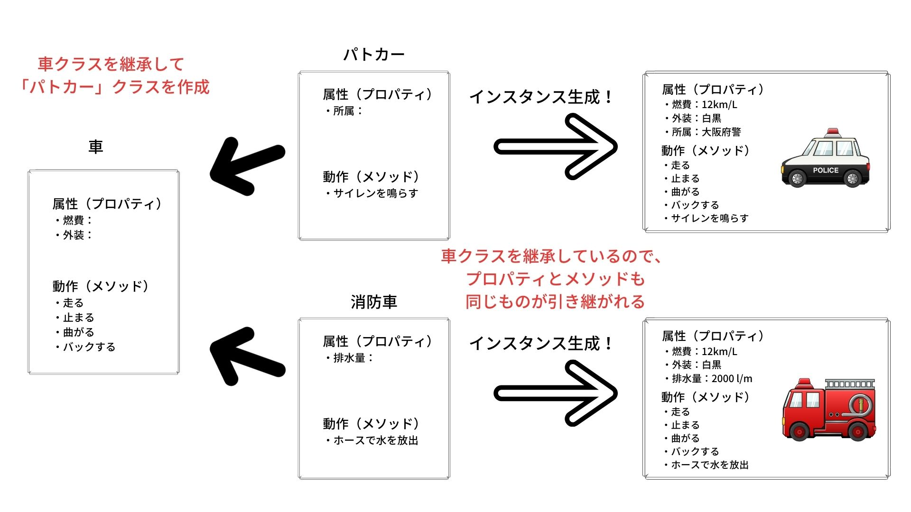
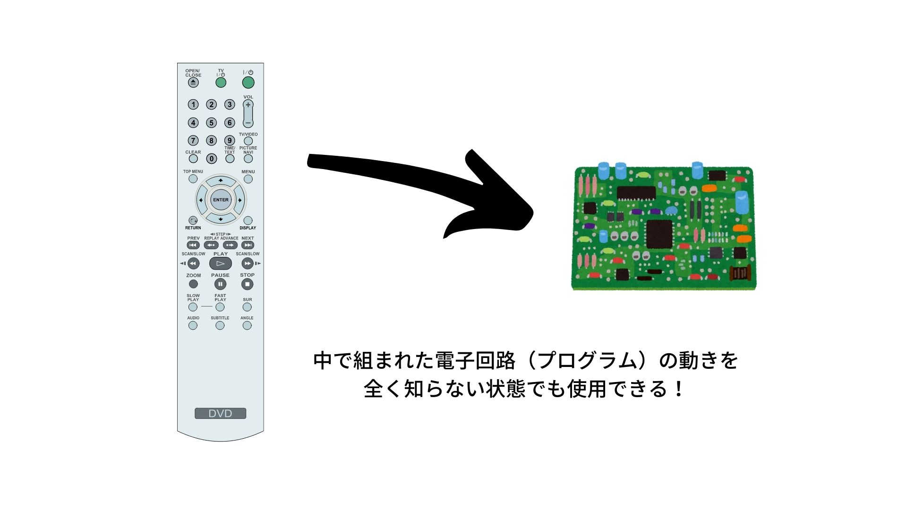

# はじめに

この記事はオブジェクト指向、オブジェクト指向プログラミングについて自分が調べた知見をまとめています。

エンジニアとなって8ヶ月。以前まではまったく分からなかった概念や歴史について、少しずつ分かるようになってきました。
その「現時点で得た知識」を記述していこうと思います。

抽象的な概念の話が多くなっているため、コンピューターの仕組みの話など厳密で具体的な内容はあまり出てきません。
そのため、**個人的な解釈が多く含まれている**ことを予めご了承ください。

※ 決定的な解釈違いや事実誤認などあれば、ぜひともご指摘いただけると幸いです。

　

## オブジェクト指向の前に、オブジェクトって？

「オブジェクト」とは「物、物体」などの意味を持った英単語のこと。
私たちは人間世界において、知覚した「もの」や「ことがら」を言葉としてパッケージしています。

たとえば、テーブルと椅子、銀行ローンと利子、スマートフォンとiPhone、などのような名称で呼ばれるもの。
実体があるかないか問わず、それらの言葉によって人は「モノ」を認識することができるようになりました。

IT用語としての「オブジェクト」とは、こうした人間社会における「モノ」をコンピューターの世界で表現しようとしたものです。

　

## オブジェクト指向の起源

オブジェクト指向の概念を取り入れたプログラミング言語の起源は、1967年にノルウェーで考案されたプログラミング言語である「Simula67」が始まりと言われています。

この言語はこれまで存在しなかった「クラス」「ポリモーフィズム」「継承」という仕組みを備えており、現代におけるオブジェクト指向プログラミングの基本概念が揃えられていました。
しかし、この頃はまだ「オブジェクト指向」という言葉はなく、言語的な未熟さなどもあり広まりはしませんでした。

「オブジェクト指向」という言葉は、1972年から1980年にかけてプログラミング言語「Smalltalk」を開発したゼロックス社パロアルト研究所の科学者アラン・ケイの発言から始まったものとされています。

「Sumalltalk」は「Simula」の言語仕様を引き継ぎ、「オブジェクト指向」というコンセプトで確立させた言語として次第に知名度を得ていくこととなります。
その後、C++やObjective-C、Java、C#、Rubyなど、同様の仕組みを備えたプログラミング言語が続々と登場します。オブジェクト指向という考え方は世界中に広まっていき、現在のシステム開発において欠かせない考え方となりました。

　

### Tips
現代において、オブジェクト指向とは多彩な意味合いを含んだ概念となっています。

> C++の設計者であるBjarne Stroustrupは著書『C++の設計と進化』の中で「classはユーザー定義型を作るためのしくみ」(p.35)と説明しています。。また論文（注1）で「Simulaの継承機構が問題解決の鍵」（p.7）、「オブジェクト指向プログラミングとはユーザ定義型と継承を使ったプログラミングのことだ」（p.19）と説明しており、型や継承にとても肯定的です。
> 
> 一方、「オブジェクト指向」という言葉の発明者であり、Smalltalkの設計者であるAlanKayは違う意見です。「オブジェクト指向」という言葉の意味について質問された彼は、解説の過程で「型に反対なわけではないが、苦痛でない型システムを見たことがない」「Simulaの継承のやり方は好きではない」「オブジェクト指向とは『状態を持ったオブジェクトがメッセージを送りあうことでコミュニケーションする』というモデルでプログラムを表現することだ」（注2）と述べており、型や継承に否定的な立場がうかがえます。
> 
> 引用：西尾 泰和. コーディングを支える技術成り立ちから学ぶプログラミング作法 (WEB+DB PRESS plus) (Japanese Edition) (p.311). Kindle 版. 

上記から、オブジェクト指向の提唱者であるはずのアラン・ケイの考えとは違った方向に概念が発展していると考えられます。このことから、明確な答えの存在しない、個々人の解釈に委ねられる考え方となっていき「なんだか難しいもの」というイメージも強く根付いてしまったのではないかと感じました。

以下は、2003年にオブジェクト指向についてメールで質問したステファン・ラム Stefan Ram さんが、アラン・ケイの了承を得て公開したメールです。

http://userpage.fu-berlin.de/~ram/pub/pub_jf47ht81Ht/doc_kay_oop_en


> I thought of objects being like biological cells and/or individual computers on a network, only able to communicate with messages (so messaging came at the very beginning -- it took a while to see how to do messaging in a programming language efficiently enough to be useful).

> 私は、オブジェクトが生きものの細胞、あるいはあるネットワーク上にある個々のコンピュータのような存在だと考えています。それらは、メッセージだけでコミュニケーションをとります (だからメッセージングというアイディアは最初からあったのですが、プログラミング言語でうまく使うしくみが分かるまでに少し時間がかかりました)。

こちらの記事での翻訳を掲載させていただきました。
https://note.com/go_fujita/n/n1d157e658f9a

上記によると、それぞれある程度自立した存在であるオブジェクトが集まりあってグループを作り、互いの相互作用によって作り上げられるしくみをイメージしている。といった解説がされています。

初学者の頃は特に「クラス」や「インスタンス」の概念がよく説明され、それがもっとも重要と考えていましたが、提唱者からみたオブジェクト指向はまた要点の異なったものであると知り非常に興味深く感じました。

このあたりはまだまだインプットと考察の最中で、深い理解には至ってはいません。以下のブログなどの考察も非常に参考になり、現在も噛み砕いて解釈を続けているところです。
https://ubiteku.oinker.me/2016/05/09/what-is-oo-all-about/

　


## オブジェクト指向とは

起源についてつらつらと書きましたが、現代のシステム開発で大きく解釈されているオブジェクト指向って一体何やねん。
というところから、さまざまなところで解説されているオブジェクト指向について記述していこうと思います。

オブジェクト指向とはざっくりいうと、「オブジェクト」として定義した「モノ」を組み合わせて、システム全体を構築していく考え方や手法のことです。

過去のオブジェクト指向以前でのプログラミング手法では、どこにどのようなプログラムが書かれているのか非常にわかりづらくなることが頻繁に発生していました。また、増大するシステムの規模に対応できる「大規模な再利用」部品に関しても必要性が唱えられていましたが、なかなか実現することができない状態でした。

そこで現れたのがオブジェクト指向です。
1980年代、オブジェクト指向言語として考案されたC++がGUIライブラリの開発などでその柔軟性や再利用性を実証していくことで、少しずつ脚光を浴びていくこととなります。

そして、1990年代。インターネットブームの中でJavaが現れ、世界的に広まっていったことでオブジェクト指向でのシステム開発はデファクト・スタンダードとなっていきました。

この「オブジェクト指向」によってプログラミングをしていくことを、「オブジェクト指向プログラミング」といいます。


　

## オブジェクト指向の世界のルール
- オブジェクト指向の世界では、予めすべての行動は**メソッド**として用意されている必要がある。
- そして、メッセージパッシングによってメソッドを呼び出すことで、物事が動き始める。
- オブジェクト指向の世界では、オブジェクトは与えられた指示に決して逆らわない受動的な性質を持つ。
- このようなオブジェクト指向の性質を打ち破る技術として、近年では「**エージェント指向**」というものが研究されている。

※エージェント指向については、研究はされているがまだそのコンセプトを具体的に表現するプログラミング言語は今のところ現れていません。

　

## オブジェクト指向の３大要素
　

### 継承

オブジェクト指向プログラミングの世界において、継承とは
> 「クラスの共通部分を別クラスにまとめるしくみ」
というように表現できます。

例として、車クラスでは軽自動車、スポーツカー、ダンプカーなどさまざまなインスタンスを生成することができます。



しかし、パトカーや消防車などといった特殊な車両を製造する場合は、車クラスの機能＋パトカー＆消防車独自の機能として製造する必要があります。
このとき、パトカーと消防車のクラスで個別に車のプログラムを書くのは非常に効率が悪いです。
そこで継承の出番です。



車としての機能は別クラスに切り分けて、それを継承することで複数のクラスに共通して同じ機能をもたせることができるようになります。
こうすることで、もし「車」としての基本的な機能を変更したくなった場合でも、親クラスである「車クラス」を変更するだけですべての子クラスに変更が反映されるため、変更が容易になり保守性も向上します。

　

### 多態性（ポリモーフィズム）

個人的にもっとも理解が難しかった機能です。

ポリモーフィズムとは、
> 生成したオブジェクトによって、同じメソッドでもふるまいが変わる仕組み
さらにくだいた言い方をすると、「モノ」が「そのモノ」らしく振る舞うようにすること。
オブジェクト指向プログラミングに寄せた表現にすると、「呼び出した関数」が「呼び出し元のオブジェクト」に適した振る舞いをすることです。

よくある例ですが、以下のコードで見ていきます（コードはJava）。

動物クラス（親）
```
public abstract class Animal {
	  abstract void cry(); //鳴き声の抽象メソッド
}
```

犬クラス（子）
```
public class Dog extends Animal{
	  @Override
	  void cry() {
	      System.out.println("ワン");
	  }
}
```

猫クラス（子）
```
public class Cat extends Animal{
	  @Override
	  void cry() {
	      System.out.println("ニャー");
	  }
}
```

猿クラス（子）
```
public class Monkey extends Animal{
	  @Override
	  void cry() {
	      System.out.println("キー");
	  }
}
```

動物クラスには「cry(鳴く)」というメソッド（関数）があります。
この動物クラスの子クラスに、犬、猫、猿があり、それぞれ独自にcryメソッドを実装しています。
- 犬は「ワン」と鳴く
- 猫は「ニャー」と鳴く
- 猿は「キー」と鳴く

これらを一つの言葉でいうと、
- 「？」は「？？」と鳴く
という表現をすることができるかと思います。

コードとして以下に表します。

```
public class Test {
    public static void main(String[] args) {
        Animal tama = new Cat();
        Animal poti = new Dog();
        Animal ema = new Monkey();
        tama.cry(); //「ニャー」と出力
        poti.cry(); //「ワン」と出力
        ema.cry(); //「キー」と出力
    }
}

```

動物クラスの「鳴く」を実行すると、実行したオブジェクトが「犬」であれば「ワン」と鳴き、「猫」であれば「ニャー」、猿は「キー」と鳴くようになります。このように、同じ「鳴く」でも実行するオブジェクトによって結果が変わるようにする仕組みがポリモーフィズムです。

ポリモーフィズムを使うことで、以下のように何度も処理を書く必要がなくなり、冗長なコードをなくすことができます。これがポリモーフィズムの大きなメリットです。

```
public class Test {
	public static void main(String[] args) {
		Animal[] pets = {new Cat(), new Dog(), new Monkey()};
		for (int i=0;i< pets.length;i++) {
			pets[i].bark();
		}
	}
}
```
出力
```
ニャー
ワン
キー
```

　

### カプセル化

オブジェクトのデータをカプセルのように保護する（隠す）機能。例えば、テレビのリモコンは表面に設置されたボタンを押すことによって、内部で押下したボタンに対応した電気信号を作り出し、それを電波としてテレビに発信します。
この操作を行うにあたって、われわれはリモコンの内部で動いている電子回路の動き（プログラム）を知っている必要はありません。また、外装によって内部の回路は見えなくなっているので、回路をうっかり触って変な動きをしてしまうようなこともありません（意図的に分解した場合は別として）。



カプセル化するひとまとまりの単位を「クラス」と呼び、クラス内部でしか扱えないようにするためにはデータやメソッドに「private」修飾子を付けます。
反対に、クラス外部からアクセスできるようにするためには「public」修飾子を付けます。
（他にもアクセス修飾子はありますが、ここでは割愛）

　

## まとめ
- オブジェクト指向は、現在は大きく分けて２つの概念がある。
- 提唱者であるアラン・ケイの「メッセージング」を重視したオブジェクト指向と、C++の影響を受けた「カプセル化、継承、多態性の原則」を踏まえたオブジェクト指向で、現代の主流は後者。
- 大規模なシステム開発において、再利用性を高めて効率的な開発を行うためにオブジェクト指向が広まっていった。
- 「継承」は親クラスの機能を引き継いで新たなクラスを作成できるようにする仕組み。
- 「多態性（ポリモーフィズム）」は、生成したオブジェクトによって、同じメソッドでもふるまいが変わる仕組み。
- 「カプセル化」は、中の仕組みを知らなくても、特定の動作で動くようにする仕組み。

## 参考文献
- オブジェクト指向でなぜつくるのか 第2版
- コーディングを支える技術――成り立ちから学ぶプログラミング作法 WEB+DB PRESS plus
- Wikipedia 「オブジェクト指向」