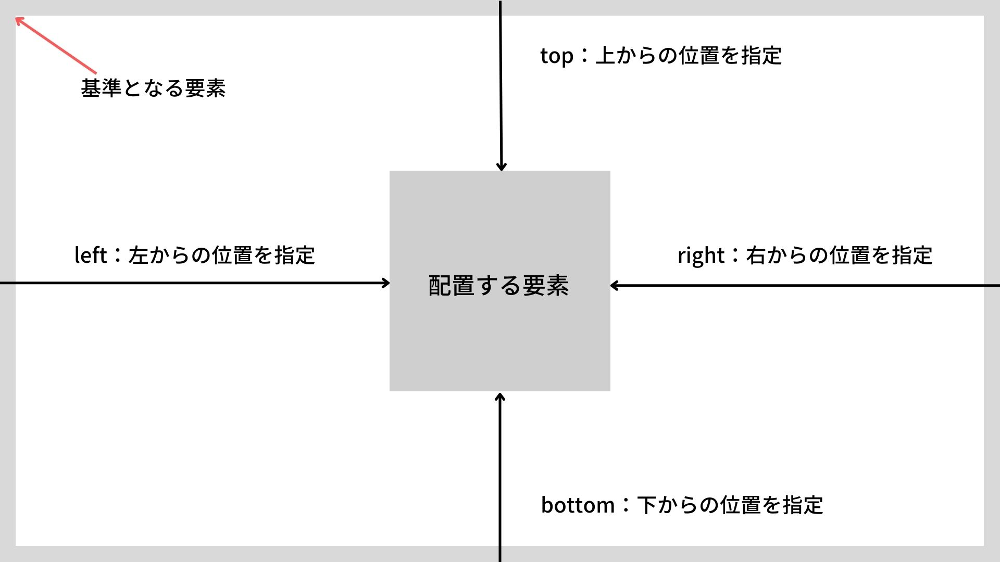

# はじめに
この記事は、HTML、CSSを書くときにいつも「なんだっけ……？」となるpositionプロパティについて、自分なりに調べたことをまとめています。

## positionプロパティとは

要素を配置する基準を指定するためのプロパティ。

値には「static, relative,absolute,fixed,sticky」の5つが指定できます。

positionは何も指定しなければ「static」という値をとるが、staticは「通常の位置で配置される」値です。

そのため明示的に指定することはほぼありません（レスポンシブなどで、absolute指定していたものをあえて外す、などといったシチュエーションはある）。

　

この記事ではその中の
- absolute
- relative

について記述していきます。

　

## 表示位置を指定するプロパティ

positionを指定する際には、合わせて「top、left、right、bottom」という位置を指定するプロパティを使用します。
それぞれ、全て使用する必要はなく、pxや%などで指定することができます。値を指定しない場合は**top: 0;** と **left: 0;** が自動的に適用されます。
すでに設定した値をリセットする場合はautoを入力します。

staticを指定した場合は、topやleftなどんプロパティを入力しても**位置を変更することはできません**。

　

## absolute
- 絶対：他に比較するものや対立するものがないこと
absoluteは「絶対位置」を設定する値。

親要素にposition:static以外を指定した場合、その親要素を基準に絶対位置を指定します。

例として、赤色に対してabsoluteを設定し、top:50px; left: 50px;を設定します。

以下の場合では、一番上の赤色の要素が動き、下にある緑色の要素が上へと詰まるといった挙動をします。

<iframe src="https://codesandbox.io/embed/headless-shadow-8fucl8?fontsize=14&hidenavigation=1&theme=dark"
     style="width:100%; height:500px; border:0; border-radius: 4px; overflow:hidden;"
     title="headless-shadow-8fucl8"
     allow="accelerometer; ambient-light-sensor; camera; encrypted-media; geolocation; gyroscope; hid; microphone; midi; payment; usb; vr; xr-spatial-tracking"
     sandbox="allow-forms allow-modals allow-popups allow-presentation allow-same-origin allow-scripts"
   >
</iframe>

　

## relative
- 相対：他との関係の上に存在している
relativeは「相対位置」を設定する値です。

通常配置される位置を基準として、移動位置を指定することができます。

以下の緑色に対してrelativeを設定し、top:50px; left:50px;を設定します。

先程のabsoluteとは違い、下にある青色の要素が上に詰まることなく、元の位置のままとなっています

<iframe src="https://codesandbox.io/embed/friendly-mcnulty-z6u72z?fontsize=14&hidenavigation=1&theme=dark"
     style="width:100%; height:500px; border:0; border-radius: 4px; overflow:hidden;"
     title="friendly-mcnulty-z6u72z"
     allow="accelerometer; ambient-light-sensor; camera; encrypted-media; geolocation; gyroscope; hid; microphone; midi; payment; usb; vr; xr-spatial-tracking"
     sandbox="allow-forms allow-modals allow-popups allow-presentation allow-same-origin allow-scripts"
   ></iframe>

　

## いろいろ動かしてみると…

以下の画像のように、absoluteを指定した赤色の要素は、同じくrelativeを指定した緑色の要素に比べて若干位置が違うように見えます。

　

どちらもtopとleftを0にしてみると……

　

赤の要素はブラウザの一番左上を基準にし、緑の要素は少し空白があることがわかります。

position: absoluteは親要素にposition: static以外の値がなければ、ウィンドウの左上が基準となります。

その逆として、親要素にposition: static以外の値（relativeなど）を設定すると、その親要素が基準になります。
この場合、以下のように親要素にposition: relativeを指定してみると……

ピッタリと重なりました！

後ろに隠れたんじゃなくてなくなったんじゃねぇだろおなぁという方。
安心してください。ちゃんといますよ。

absoluteを設定するときは、親要素にpositionが設定されているかを気にしておかないと思わぬ位置に要素が置かれてしまう事があるため注意が必要とのことでした！

## 参考にさせていただいたところ

- https://developer.mozilla.org/ja/docs/Web/CSS/position
- https://www.asobou.co.jp/blog/web/css-position
- https://qiita.com/sun19008/items/b18b2dc98443ab988ecb