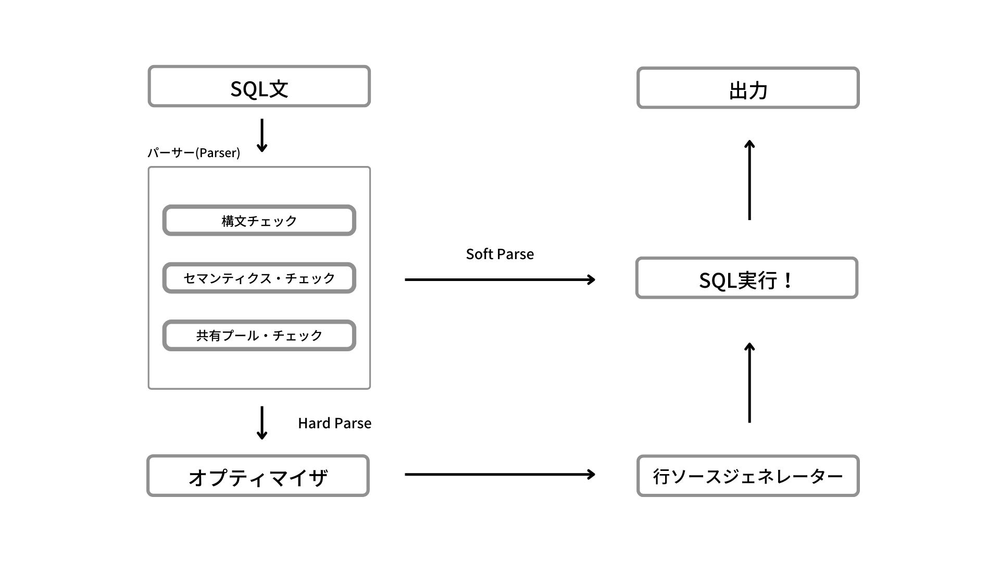

実務でoracle DBを使用している2年目のエンジニアです。

SQL、PL/SQLを書いたりするうちに、そもそもデータベースの理解が全然できてないなと感じ強化月間中です。

データベースの基本的な部分を理解・整理するために書いていきます！

「これ間違っとるやんけ！ おおん！？」というところがあればそっとTwitterなどで教えてくださるとありがたいです！

　

## オプティマイザとは

**optimization** = 最適化

オプティマイザ(optimizer)は、一般的には「処理速度の高速化」や「処理に関するメモリ量などのリソース分量の削減」を目的として用いられる機能やソフトウェアの総称です。

RDBMSにおいてのオプティマイザは、クエリを発行する際に最も効率の良い順番を探し、最適な実行計画を作成してくれる機能のことを指しています。

> オプティマイザは、考えられるすべての計画の候補中で最もコストの低い計画を選択します。オプティマイザは使用可能な統計を使用してコストを計算します。指定された環境における特定の問合せでは、コスト計算はI/O、CPUおよび通信など問合せ実行の要因から構成されます。
> 

引用 : [https://docs.oracle.com/cd/E57425_01/121/TGSQL/tgsql_optcncpt.htm](https://docs.oracle.com/cd/E57425_01/121/TGSQL/tgsql_optcncpt.htm)

　

SQLはどのテーブルからどういったデータを取得するかを記述したもので、**DBからどういう手順でデータを取得するか**は書いていません。

基本的にはSQLからオプティマイザが「一番これが最適やし速いやろ」といった感じで、一番効率の良いデータの取り方を計画・作成してくれます。

具体的には以下のように

- 全表スキャン（フルスキャン）を実行するか
- インデックス（索引）を使用するか
- どういう順番で結合するか
- パラレル度はどうするか
- etc…

などの情報から最適な実行計画を作成します。

　

## オプティマイザの種類

### CBO（コスト・ベース・オプティマイザ）

テーブル、列、索引（インデックス）の統計情報を使用して、最適な実行計画を立てていく方式。

**メリット**

データの件数の偏りに左右されず、最適な実行計画を立てることができる。

**デメリット**

データ件数が一気に増減した場合に、最適な実行計画を立てずに古い実行計画のまま実行すると、突然パフォーマンスが低下する可能性がある点。

　

### RBO（ルールベース・オプティマイザ）

Oracle10g以降はサポート対象外。なので、現在使用することはほぼない。

SQL構文のルールに基づき実行計画を選択する方法。

**メリット**

統計情報に左右されない。

**デメリット**

ハッシュ結合、パラレルクエリ、パーティション表の機能など最新の機能が使えない。

　

## そもそも、SQLがどんな流れで実行されるか

SQL文の処理の流れは、

- Soft Parse
- Hard Parse

上記2つのパターンがあります。

2つの処理の違いはシンプルで

- Soft Parse
    - 共有プール上にSQLの実行計画がキャッシュされていた
- Hard Parse
    - 共有プール上にSQLの実行計画がキャッシュされていなかった

といった違いによって分岐します。

　

まず、SQL文が発行された後、1番にパーサー(Parser)と呼ばれる箇所で3つのチェックが行われます。

- 構文チェック
    
    SQLの構文が正しく書かれているかをチェックします。
    
    ここでは以下のような、単純にFROMをFORMなど間違えて記述している文があればチェック失敗となります。
    
    `SELECT * FORM employees;`
    
- セマンティクス・チェック
    
    セマンティクスとは文の意味のことです。SQL文内のオブジェクトや列が存在するかなど、「文の意味」が有効なものであるかを判断します。
    
    以下のように、構文的に正しくても「not_employees」というテーブルが存在しない場合、ここでチェックが失敗します。
    
    `SELECT * FROM not_employees;`
    
- 共有プール・チェック
    
    共有プールとは、SGA（システムグローバル領域）というメモリー領域の一つです。
    
    この共有プールには
    
    - SQL本文（ユーザーが入力したSQLの文章）
    - 解析済みコード（コンピュータでもわかるようにSQL文を変換したソースコード）
    - 実行計画
    
    が格納されます。
    
    また、共有プールは主に
    
    - ライブラリ・キャッシュ
    - データ・ディクショナリ・キャッシュ
    
    から構成されています。
    
    以下、2点に関して詳細を記述していきます。
    
    **ライブラリキャッシュ**
    
    解析済みのSQLコードやPL/SQLコード、実行計画を格納する共有プール・メモリー構造です。SQL文が実行されると、データベースでは以前に実行されたコードの再利用が試みられます。ライブラリ・キャッシュ内に解析済SQLがあった場合には、そのコードが再利用されます。
    
    **データ・ディクショナリ・キャッシュ**
    
    データ・ディクショナリとは、表と列の定義、やユーザー名、パスワード、アクセス権限などを記録する領域のことです。データ・ディクショナリ・キャッシュには、これらのオブジェクトに関する情報が保持されています。また、データがバッファではなく行として保持されるため、このキャッシュは**行キャッシュ**とも呼ばれています。
    
　

共有プールにキャッシュが存在するかチェックが行われたのち、存在していれば「Soft Parse」でSQLが実行され、存在していなければ「Hard Parse」としてオプティマイザが実行され、実行計画が作成されます。

実行計画の作成はそれなりに時間がかかる処理です。そのため、同じSQLを実行した場合でも1回目の実行と2回目の実行では速度に大きな差が生まれます。SQLの正確な性能測定を行いたい場合には、以下のコマンドで共有プールの開放などを行うのがベターです。

`ALTER SYSTEM FLUSH SHARED_POOL;`

　

## まとめ

オプティマイザについて知ろうといろいろ調べ始めましたが、そもそもSQLの実行までにいろんな処理が絡んでいると知り、まとめざるを得なくなっていきましたw

調べてるうちに「行ソースってなんやねん」という疑問がありましたが、それはまた次の機会に…

ドキュメント読んでるとキリがないくらいいろんな仕組みがあって深い（というよりは深淵）ので、また改めてどんどん学んでいこうと思います！

　

## 参考
[4 問合せオプティマイザの概念](https://docs.oracle.com/cd/E57425_01/121/TGSQL/tgsql_optcncpt.htm)

[6 実行計画の生成と表示](https://docs.oracle.com/cd/E57425_01/121/TGSQL/tgsql_genplan.htm#GUID-60E30B1C-342B-4D71-B154-C26623D6A3B1)

[14 メモリー・アーキテクチャ](https://docs.oracle.com/cd/E16338_01/server.112/b56306/memory.htm#BABEJJEG)

[コストベースオプティマイザ徹底解剖！](https://www.oracle.com/technetwork/jp/ondemand/branch/20150218cbo-2525047-ja.pdf)

[～共有プールの謎～](https://itsoldier0901.hatenablog.com/entry/2016/11/22/020500)