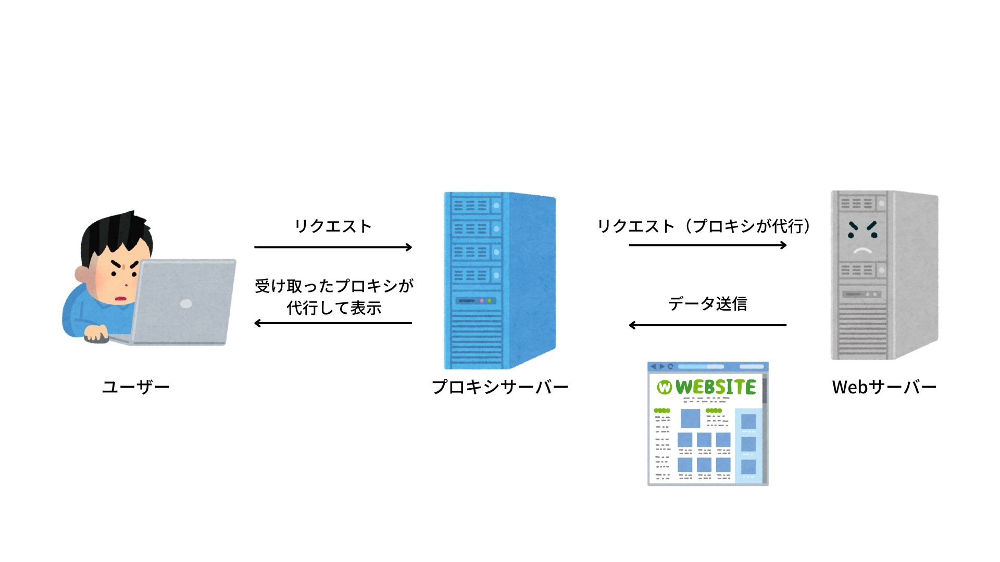

　

新しくプロジェクトに入ってきたメンバーの環境構築を手伝っていたら、「プロキシ」という言葉の意味についてふわーーーっとしか理解できてない事を実感しました。

そこで今回は、プロキシの概要やキャッシュ、アクセスログの解析などについて調べてみることにしました。

自身の忘備録として記載していこうと思います。

　

## プロキシ（proxy）とは

直訳では「代理」や「代わり」といった意味を持ちます。
一般的にはHTTP通信を代理するWebプロキシ（フォーワードプロキシ）を指すことが多いです。

インターネットに接続する際に、ネットワークの内部から外部へのアクセスを「代理」で行うシステムのことを指します。
これを「プロキシサーバー」とも呼ばれ、サイバー攻撃などから身を守る手段として用いられています。

インターネットへの接続は通常、端末（PCやタブレット）がブラウザを経由して、直接Webサイトにアクセスします。
プロキシを用いて接続をする場合、端末はまずプロキシサーバーにアクセスを行い、プロキシが代わりに目的のWebサイトにアクセスしてデータを受け取り、ブラウザに表示させてくれます。

これによって、プロキシが仲介人として端末と外部（Webサイトなど）を取り持ってくれるので、セキュリティが向上します。

　

## プロキシのメリット

　

### 匿名性の確保

前述のように、プロキシを使用することで直接Webサイトにアクセスしなくなるので、運営者側に対して匿名性を確保することができます。
そのため、接続側から見た時は端末からのアクセスではなく、プロキシ自身が通信しているように見えます。

例えば日本に端末があったとして、使用するプロキシサーバーのIPアドレスがアメリカにあった場合、Webサイトの運営者は「アメリカからアクセスがあった！」というように認識されるようになります。

企業などの専用回線は、そのままインターネットに接続してしまうと、もし特定されてしまった場合サイバー攻撃などに曝されてしまう可能性があります。
そのため、インターネットに接続する際は端末から直接接続せず、プロキシを用いることがほとんどです。

　

### キャッシュ機能の高速化

キャッシュ（cache）とは、**訪問したWebページの情報を一時的に保存する仕組み**です。
キャッシュ機能があることで、一度訪問したWebページの内容を再度読み込む際に、一度目よりも高速で処理することができます。
通常のキャッシュでは端末にデータが保存されるため、別の端末からアクセスしてもキャッシュが使われることはありません。

プロキシを介している場合、同じプロキシサーバーに接続する端末であれば、蓄積されたキャッシュを共通で利用することができます。
社内での人々が頻繁にアクセスするようなサイトがあった場合などは、キャッシュによって高速表示することが可能となります。

　

### アクセスログの確認が可能

端末からプロキシサーバーを介してWebサイトにアクセスすると、アクセスしたWebサイト側に端末の情報が渡ることはありませんが、プロキシサーバーにはアクセス情報がログとして残ります。

そのため、プロキシサーバーを用いている企業などでは「社員が業務に関係ない**変なサイト**」にアクセスしていないかをチェックすることも可能です。

　

### プロキシ上でウィルスチェックができる

プロキシ上でウイルスチェックを行うことで、インターネット上から端末にウィルスが侵入してしまうのを防ぐことができます。

端末でチェックを行うのではなくプロキシでチェックを行うことで、社内ネットワーク屁の侵入自体を防ぐことができるので、

- 安全性がより向上する
- ウイルスチェックがプロキシ上での管理となり、運用が楽になる

上記のような効果を得ることが可能です。

　

## プロキシの種類

　

### フォワードプロキシ

一般的に「プロキシ」という場合には、このフォワードプロキシのことを指す。

フォワードプロキシはクライアント（コンピュータ）とインターネットの間に設置され、「クライアントの代わりにインターネットに接続してくれる」プロキシのことです。

　

### リバースプロキシ

WebサイトのWebサーバーとインターネットの間に設置されます。

フォワードプロキシとは反対の役割を持つので「逆プロキシ」とも呼ばれます。

以下で、フォワードプロキシとリバースプロキシを比較してみます。

- フォワードプロキシを用いた通信
  「クライアント」→「フォワードプロキシ」→「インターネット」→「Webサーバー」

- リバースプロキシを用いた通信
  「クライアント」→「インターネット」→「リバースプロキシ」→「Webサーバー」

　

つまり、これら2つは以下のようなシチュエーションによって使われます

　

フォワードプロキシ
- ユーザがWebサイトにアクセスする際に、通信の安全性を確保するために経由する

リバースプロキシ
- アクセスされるWebサイト側が、不正アクセス防止などを目的として設置する

　

## まとめ

「代理でうまいことWebにアクセスしてくれるもの」くらいの認識しかなかったですが、改めて調べてみることで知識が深まったかなと感じます。
次回からは新人にも説明できるぞ……！

掘り下げて調べてみていくと、とにかく実際に自分で触ってみるほうがより良いかと思うので、今後自身でプロキシサーバーを立ち上げるなどもチャレンジしてみたい。

　

## 参考

[プロキシとは？主なメリットやデメリット、注意点から種類まで徹底解説！](https://it-trend.jp/cyber_attack/article/442-0042)

[プロキシサーバーの閲覧履歴について](https://luminati.site/archives/1577)

[プロキシサーバーとは？使用上のメリットと4つの注意点](https://jp.norton.com/blog/etc/proxy-server)

[プロキシサーバーとは？使用上の５つメリットと注意点について](https://cybersecurity-jp.com/column/32171#i-3)

[個人でプロキシサーバーを立てるメリット](https://g-geek.net/column/proxy-server-merit)