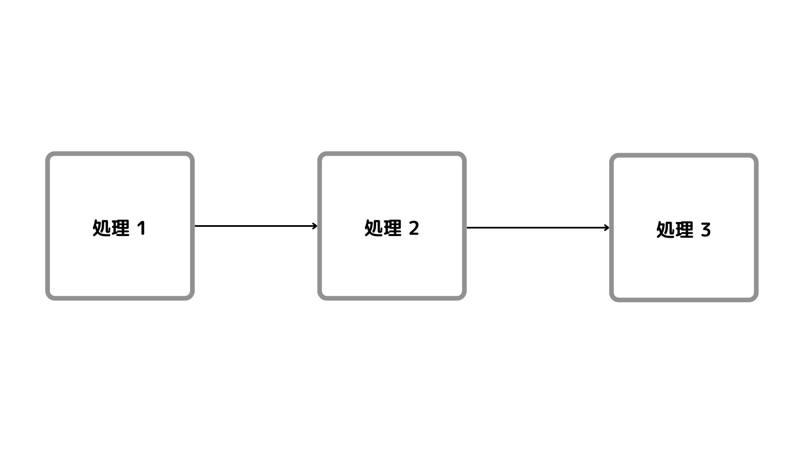
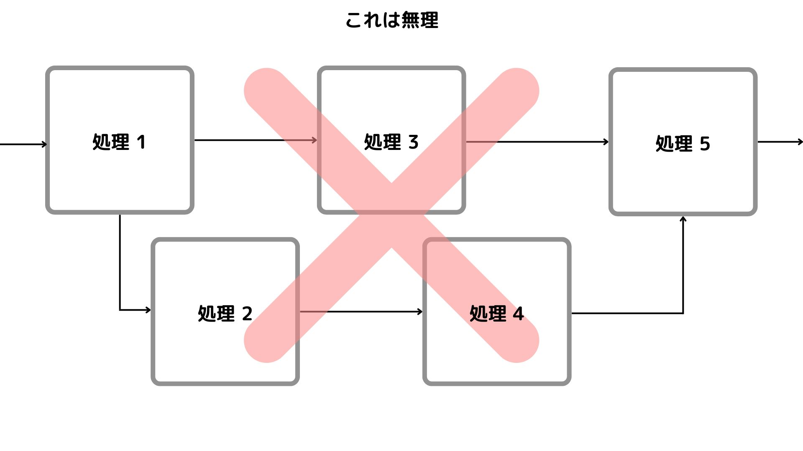
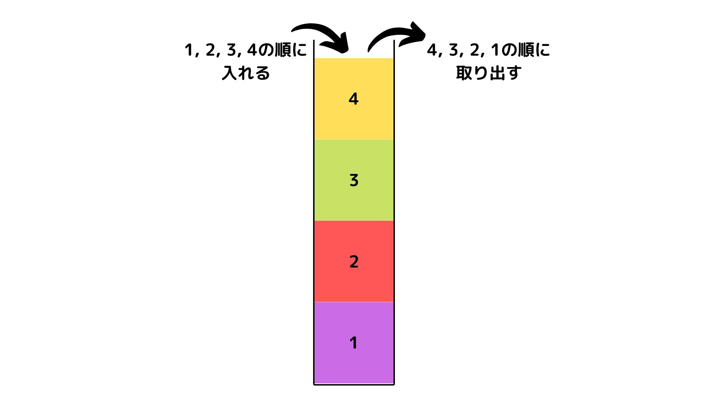
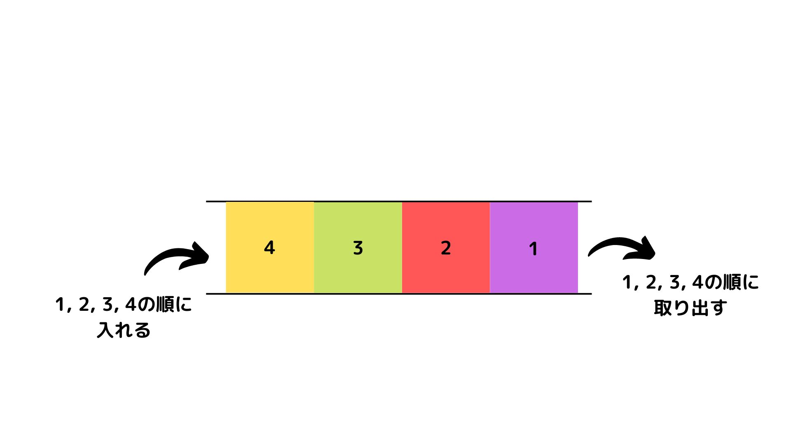
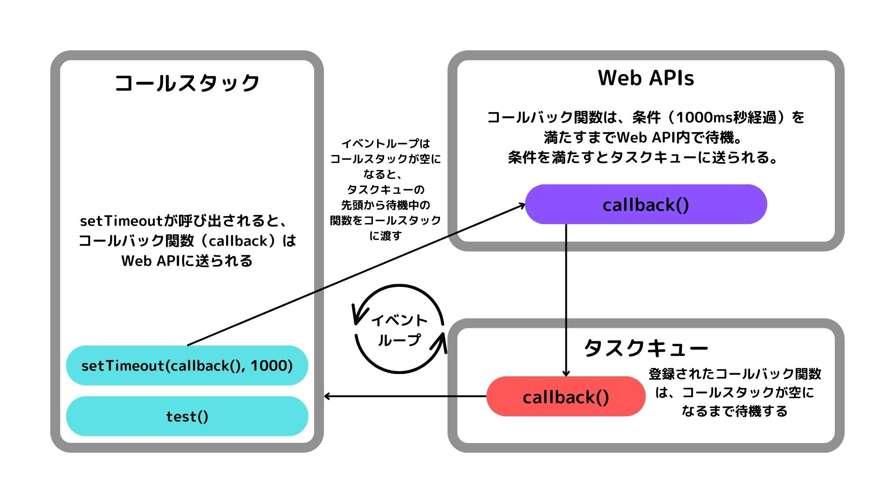

JavaScriptでの非同期処理（async, awaitやPromise）について、実務で使って「完全に理解した」と思っていたのですが、ものの見事にうすーーっぺらな理解であったことが露呈したので、記事として学習したことをまとめている記事です。

深掘りすればするほど、「イベントループ」やら「コールスタック」やら仕組みから理解する必要が出てきたため、何編かに分けて書いていきます。

「完全に理解する」ためのものなので、さらなる高みにおられる方は一番下の**参考**から今回学習したものを辿っていただければと思います！

　

# 非同期処理とは

　

## 同期処理

英語では**synchronous**と書きます。

ひとつの処理が終わってから次の処理へと順次処理されていくことをいいます。

```
処理①

　↓

処理②

　↓

処理③
```

上のように、初めに実行された処理が終わったら2番目の処理が実行され、2番目の処理が実行されたら3番目の処理が実行され、以下続いていく…。という流れになります。

処理を順番に書いていけばその通りに実行してくれるので、コードを追う時も動作がどうなるのか予測しやすく、直感的に理解することができます。

　

## 非同期処理

英語では**asynchronous**と書きます。同期通信のsynchronousに対して、「a」が頭につきました。

ある処理が終了するのを待たずに、別の処理を行っていくことをいいます。

```
処理A 開始

　↓

処理B 開始

　↓

処理B 終了

　↓

処理C 開始

　↓

処理A 終了

　↓

処理C 終了
```

初めにAという処理が行われ → 終了を待たずにBという処理が実行される → 処理Bの終了と同時に処理Cが実行され → その間に処理A終了し → 最後にCが終了。

　

というような流れとなったりします。

ぱっと見ただけでもだいぶ複雑そうです。駆け出した頃にはほぼ100％の方が躓くことになるかと思います。実際僕もそうです。

しかし、この非同期処理。Webアプリケーションの開発業務においてはほぼ100％扱うことになります。避けては通れない関門でございます。

　

## JavaScriptの処理

JavaScriptは「シングルスレッドの言語」であり、その通りシングルスレッド（単一のスレッド）で処理が実行されます。

つまり、**2つの処理（関数）を並列して**実行させることができない言語です。
ひとつの処理が終わったら次の処理を行い、終わったら次の処理……というような流れで続いていきます。





JavaScriptはブラウザで動作する言語なので、ブラウザのメインスレッド上でのみ実行されます。

> メインスレッドは、ブラウザーがユーザーのイベントや描画を処理するところです。既定では、ブラウザーは単一のスレッドを使用してページ内のすべての JavaScript を、レイアウト、再フロー、ガベージコレクションなどと同様に実行します。

引用: https://developer.mozilla.org/ja/docs/Glossary/Main_thread

上記のように、イベントの処理やレンダリングの処理もこのメインスレッドで行われています。

そのため、例えばJavaScriptで10秒かかる処理を書いたとします。そうすると、ユーザーはブラウザに対して10秒間、クリックなどといったイベントを発火させることもできなくなってしまいます。
このように長時間メインスレッドを占有してしまうことを **ブロッキング（Blocking）** と言います。


10秒間も操作できなくなるUIなど、現代人にとってはたまったものではありません。僕なら発狂しそうです。

なので、JavaScriptにおいていろいろな作業を同時進行で行う非同期処理は、非常に重要な役割を担っています。

しかしJavaScriptはシングルスレッドで処理を行う言語と言いました。どうやって非同期処理を実現しているのでしょうか。


　

## JavaScriptの処理を担う4つのメカニズム

非同期処理はJavaScriptの言語機能のみで成立しているわけではなく、さまざまな仕組みが組み合わさって実現されています。
ここでは、非同期処理を実現するために重要な機能を大きく4つを上げていきます。

　

- コールスタック
    
    現在どの関数が呼び出されているのか、関数の中でどの関数が呼び出されたかなどを追跡する
    
    （メインスレッドはこのコールスタックによって管理されている）
    
- タスクキュー
    
    非同期関数の**引数に渡された関数**（コールバック関数）が登録される
    
    コールバック関数はこのタスクキューで待機する
    
- WebAPI
    
    JavaScriptの機能ではなく、外部（ブラウザ等）から提供される機能
    

- ヒープ
    
    データを格納する場所（メモリ領域）
    ※ この記事ではあまり取り上げません

　

## 「スタック」って何？

Last In, First Out (LIFO)

最後に保存したデータから取り出し、最初に保存したデータは最後に取り出されるデータ構造のことです。



コール**スタック**とは？

このスタックの構造で、関数が実行・削除される仕組み

> スクリプトが関数を呼び出すとき、インタープリターはそれをコールスタックに追加し、それから関数の実行を始めます。
> 
> その関数から呼び出されたどの関数も、コールスタックのその上に追加され、呼び出し先を実行します。
> 
> 現在の関数が終了すると、インタープリターはスタックからそれを外し、最後のコードがリストされている場所から実行を再開します。
> 
> スタックが割り当てられている量よりも多くのスペースを使用した場合、 "stack overflow" エラーとなります。
> 

引用: [https://developer.mozilla.org/ja/docs/Glossary/Call_stack](https://developer.mozilla.org/ja/docs/Glossary/Call_stack)

まとめてみると……

関数が実行されるとコールスタックにその関数が追加（push）され、処理が終了すると削除（pop）されます。前述したようにJavaScriptはシングルスレッドなので1つのコールスタックしか持っておらず、追加や削除などについても1回に1つのことしかできません。

　

## 「キュー」って何？

First In First Out (FIFO)

一番初めに保存したデータ（First In）を一番最初に取り出す（First Out）データ構造のことを指します。



タスク**キュー**とは？

非同期関数の引数に渡された関数（コールバック関数）はタスクキューに登録され、コールスタックが空になるまで待機します。

コールスタックが空になると、登録した順(FIFO)にコールスタックへ移されていきます。


　

## WebAPIって何？

APIとは？

（Application Programing Interface）

ざっくりいうと複雑な機能を簡単に使用できるようになる仕組みです。
JavaScriptにおける非同期処理は、このWeb APIが大きな役割を担っています。

- setTimeout
- setInterval

上記は、JavaScriptを扱う上で一度は見たことがある関数かと思います。これらの関数はブラウザが提供するTimerAPIという「API」を利用しています。

超余談ですが、console.log()もAPIです（正確にはConsole APIにあるlogメソッド）。完全にJavaScriptの機能かと思っていたので、なかなか驚きました。

　

JavaScriptはこの**WebAPIに処理を任せる**ことによって、シングルスレッドにも関わらず非同期処理が実現できます。
詳しい仕組みについては後述します。

　

### Web API？ ブラウザAPI？

ブラウザによって提供されるAPIはMDNではひとまとめに「Web API」と呼ばれています。

https://developer.mozilla.org/ja/docs/Web/API


ただ実態としては主にブラウザ環境が提供しているAPIであり、「ブラウザーAPI」といった言葉の方が役割として適しているかと感じました。
下記は上と同じくMDNですが、こちらでは「ブラウザーAPI」として、一般的にWeb APIとして用いられているAPIたちが説明されています。

https://developer.mozilla.org/ja/docs/Learn/JavaScript/Client-side_web_APIs/Introduction


Web APIと呼ばれたら、大抵は「ブラウザ環境が提供する機能のこと」と覚えておいて問題はなさそうです（問題ありそうであれば、Twitterや問い合わせからこそっと教えてください）。

ちなみに今回の記事では、（ややこしいですが）一般的に使われている「Web API」という呼称を扱い進めていきます。

　

ひとつ上のMDNから引用すると、クライアントサイドにおいて、JavaScriptで扱うWeb APIには大きく分けて2つがあります。

- Browser API
   
  ブラウザーやコンピューター環境の情報を取得し、さまざまな処理を行うことができる。JavaScriptの機能を用いて、より簡単に機能を実装するため、ブラウザーに組み込まれた仕組み。

- サードパーティーAPI

  Twitter APIやGoogle Map APIなどのように、ブラウザからではなくWeb上のサービスなどから提供されているAPI。

ブラウザが提供する機能か、Webサービスが提供する機能か。サービスを運営する場合では意識的に見分ける必要があるかと思います。
サードパーティーAPIを使用する場合はサービスの終了や障害などによって自身のサービスにも影響を及ぼすため、注意が必要です。

　

## イベントループ

- コールスタック
- Web API
- タスクキュー

を使った非同期処理の仕組み・機構が「イベントループ」です。

イベントループとは、「コールスタックが空になる度に」タスクキューからのコールバック関数をコールスタックへ送り出します。



コールスタックが空になると、タスクキューの先頭から待機中の関数をコールスタックに渡します。

上の図では、setTimeout関数を実行する際を例に取っています。

setTimeout関数がコールスタックで実行されると、コールバック関数としてcallbackという関数をWeb APIに渡します。

すると、Web API → タスクキューと流れて、コールスタックが空になるまで待機されます。
コールスタックが空になったら（関数の実行が完了したら）タスクキューからコールバック関数が渡される、といった動作をしています。

　

この動きが、JavaScriptの非同期処理を完全に理解するにあたって非常に重要な概念かと思いますので、これまで記述してきた概要を踏まえつつ、仕組みや動きについてコードで例を交えて次回の記事でまとめていこうかと思います！

## 参考

イベントループに関して視覚的に理解ができる
[loupe](http://latentflip.com/loupe/?code=JC5vbignYnV0dG9uJywgJ2NsaWNrJywgZnVuY3Rpb24gb25DbGljaygpIHsKICAgIHNldFRpbWVvdXQoZnVuY3Rpb24gdGltZXIoKSB7CiAgICAgICAgY29uc29sZS5sb2coJ1lvdSBjbGlja2VkIHRoZSBidXR0b24hJyk7ICAgIAogICAgfSwgMjAwMCk7Cn0pOwoKY29uc29sZS5sb2coIkhpISIpOwoKc2V0VGltZW91dChmdW5jdGlvbiB0aW1lb3V0KCkgewogICAgY29uc29sZS5sb2coIkNsaWNrIHRoZSBidXR0b24hIik7Cn0sIDUwMDApOwoKY29uc29sZS5sb2coIldlbGNvbWUgdG8gbG91cGUuIik7!!!PGJ1dHRvbj5DbGljayBtZSE8L2J1dHRvbj4%3D)

[15分で理解するJavaScriptのイベントループ](https://qiita.com/l1lhu1hu1/items/57dcc7cb867eee951f36)

[イベントループとプロミスチェーンで学ぶJavaScriptの非同期処理](https://zenn.dev/estra/books/js-async-promise-chain-event-loop)

[非同期 JavaScript 入門](https://developer.mozilla.org/ja/docs/Learn/JavaScript/Asynchronous/Introducing)

[JavaScriptの非同期処理をできる限り正確に理解する](https://qiita.com/UTDoi/items/d49ea919818d9b519f93)

　

## さいごに

何か間違い等あればご指摘いただけますとありがたいです！