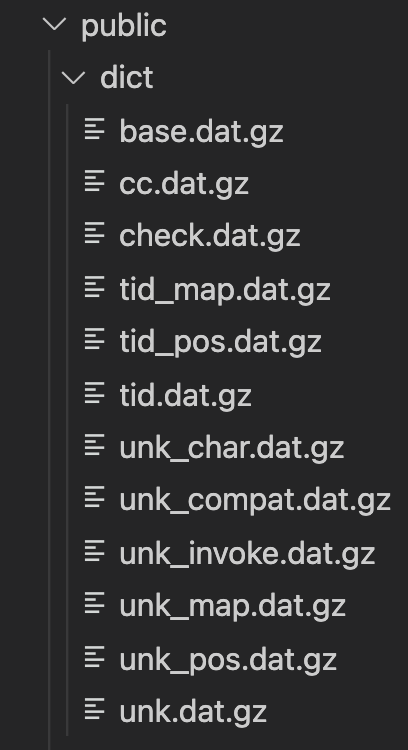
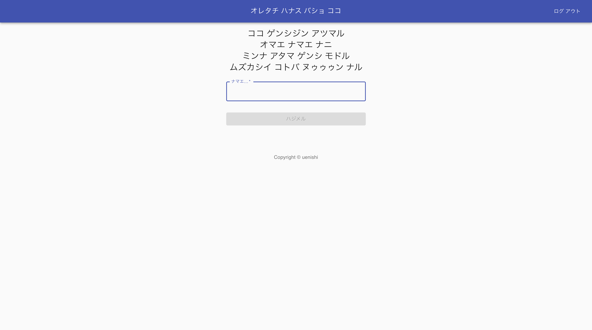
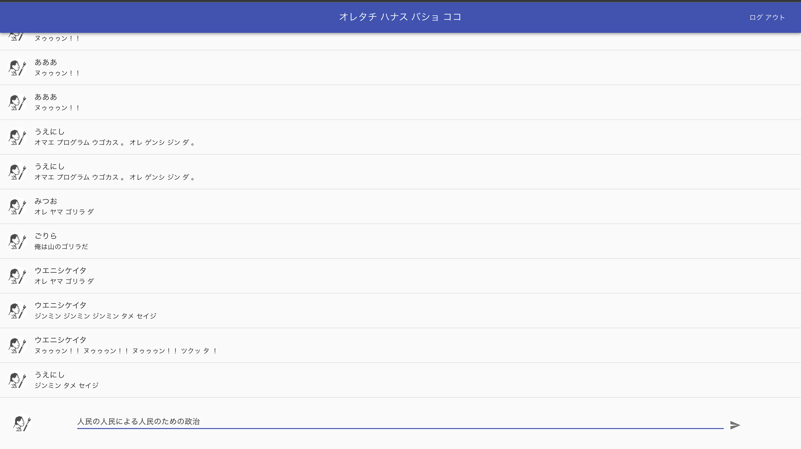
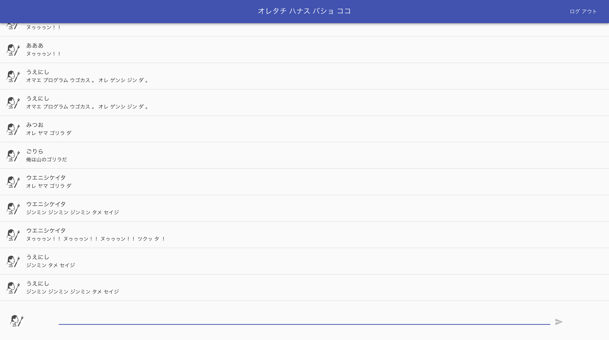

# この記事について

- この記事では、チャットアプリの作り方については解説していません
- チャットアプリを作る中で、自分が「原始人語に変換してぇなぁ」と思ったのでその技術についての忘備録を記しています
- 技術の記述に関してはReact × Firebaseでkuromojiを導入し、形態素解析を使って原始人語に変換する過程
- アプリはまだ開発中です
- ネタアプリづくりの個人的ネタブログです

　


## 原始人語で話してぇ

現在エンジニアとしての業務歴9ヶ月目の新米。

普段の業務ではC#, ASP.NET MVC, jQueryをメインに扱っています。

最近個人的にFirebaseの学習をしようと、React × Firebaseを使ってチャットアプリを作りました。

主に学習として参考にさせていただいたのはUdemyの[こちら](https://www.udemy.com/share/103Jic3@YZLhDhSPRJydX5ckjP8ECxyKpWSKRCPIS2Mo1pzTb_G_T_bDe4S5tcl21QtyyWTHKA==/)

非常にわかりやすく、丁寧な説明でしっかり学べる内容でした。

　

一通りハンズオンを終え、自分が作ったチャットアプリで遊んでいるうちにふと気づきました。

「最近の人間界の言語って、複雑すぎじゃね？」

別に特別な何かがあったわけではありません。ただ漠然と言葉を入力していくうちに、気づいてしまったのです。高度に知能を積み重ねた人間の言語機能は、現代においてコミュニケーションコストという弊害を生み出しているということを……。

　

そして僕は考えました。

「知性を最低限まで落とし込んだチャットアプリを作ろう！」

それが、タイトルにあるアプリを作ってみようと思った最大の動機です。

　

## kuromojiの導入

Reactで開発を行っていくにあたって、ブラウザ上で形態素解析ができるツールはないものかと探していたら、ありました。

- [kuromoji.js](https://www.npmjs.com/package/kuromoji)

こちらのnpmパッケージを自分のプロジェクト内にインストールします。

```jsx
npm install kuromoji --save
```

インストールした時にバンドルされている辞書を、ブラウザからアクセスできるディレクトリ（public）にコピーします。

```jsx
npm cp -a node_modules/kuromoji/dict public/
```

メモ

cp -aは「なるべく”そっくりそのまま”コピーする」

- 「-d（シンボリックリンクをそのままコピー）」
- 「-R（ディレクトリを再帰的にコピー」
- 「--preserve=all（属性を保持）」

という3つのオプションを同時に指定した場合と同じ。

　

こんな感じでpublicフォルダにコピーができました。



これで導入は完了です！

　

## いざ、使ってみる

```jsx
import kuromoji from 'kuromoji'

/* 省略 ... */

  
const text = '俺は山のゴリラだ';

kuromoji.builder({ dicPath: "/dict" }).build((err, tokenizer) => {
  if(err){
    console.log(err)
  } else {
    const tokens = tokenizer.tokenize(text)
    console.log(tokens);
  }
})

```

コンソール

```jsx
(6) [{…}, {…}, {…}, {…}, {…}, {…}]
	0:
	basic_form: "俺"
	conjugated_form: "*"
	conjugated_type: "*"
	pos: "名詞"
	pos_detail_1: "代名詞"
	pos_detail_2: "一般"
	pos_detail_3: "*"
	pronunciation: "オレ"
	reading: "オレ"
	surface_form: "俺"
	word_id: 43750
	word_position: 1
	word_type: "KNOWN"
	[[Prototype]]: Object
	1: {word_id: 93010, word_type: 'KNOWN', word_position: 2, surface_form: 'は', pos: '助詞', …}
	2: {word_id: 1530210, word_type: 'KNOWN', word_position: 3, surface_form: '山', pos: '名詞', …}
	3: {word_id: 93100, word_type: 'KNOWN', word_position: 4, surface_form: 'の', pos: '助詞', …}
	4: {word_id: 1574290, word_type: 'KNOWN', word_position: 5, surface_form: 'ゴリラ', pos: '名詞', …}
	5: {word_id: 23680, word_type: 'KNOWN', word_position: 8, surface_form: 'だ', pos: '助動詞', …}
	length: 6
	[[Prototype]]: Array(0)
```

こんな感じで解析されます。すごい！

　

しかし本来の目的は解析することではありません。作成中のチャットアプリに導入して「原始人の言葉」に変換することです。

というわけで、以下のような実装を行いました。

コードの全容は[GitHub](https://github.com/KeitaUenishi/chatApp)まで

```jsx

import kuromoji from 'kuromoji'
import { pushMessage } from '../firebase';

export const submitMessage = ({ name, text, setText }) => {
  const createText = changeMessage(text)

  createText.then((text) => {
    pushMessage({name, text})
    setText('');
  })
}

const changeMessage = (text) => {
  return new Promise((resolve, reject) => {
    let tokens = '';

    kuromoji.builder({ dicPath: "/dict" }).build((err, tokenizer) => {
      if(err){
        console.log(err)
        return reject("reject");
      } else {
        tokens = tokenizer.tokenize(text)
        return resolve(changeTextToPrimitiveHuman(tokens))
      }
    })
  })
}

const changeTextToPrimitiveHuman = (tokens) => {
  const text = tokens.map((token) => {
    if(token.word_type === 'UNKNOWN') return 'ヌゥゥゥン！！';
    if(token.pos === '助詞'){
      return '';
    }
    else{
      return JSON.stringify(token.pronunciation).replaceAll('"', '');
    }
  })
  return text.join(' ');
}
```

チャットアプリのメッセージ送信実行時に関数submitMessageを実行するようにします。

これでいけるだろうと思ったらトラップ。

kuromojiのbuild()は非同期で行われるため、promiseを用いないと文字列の変換を行う前にメッセージの送信が行われてしまいます。

そのため、文字列の変換を行ったあとresolveを返し、submitMessage内では変換された文字列をresolveで受け取ってはじめてメッセージをfirebaseへ送信するようにしています。

　

ちなみに英語とか分からない言語は全部「ヌゥゥゥン！！」と変換するようにしています。

わからん単語飛び交いまくったらそんな気分になりません？

今後調べていくうちに解析できる言語が広まったら、拡張していくかもしれません。でもコンセプトは「ムズカシイ カイワ ヤメヨウ」なので知能拡張することはないかも。

　

というわけで、まだUIとかは全く作ってないのであれですが…

実際に入力して確認してみることにします。


何でも良いので名前を入力して……


チャット画面でメッセージを入力してみると……


enterを押すと……


できた！！

こんな感じで、原始人語に変換するチャットルームができました！

ただ、現状エンターを押したあとのタイムラグが気になります。
そのあたりの改良はLoading出したり、文字をクリアしたりしてUIを向上させていきたい。

　

まだ全然未完成ですが、以下に仮デプロイしています！
興味があるという方は一度触ってみて貰えれば！
引き続き、改良点など記事にしていきます！

[https://idobatakaigi-uenishi.web.app/](https://idobatakaigi-uenishi.web.app/)